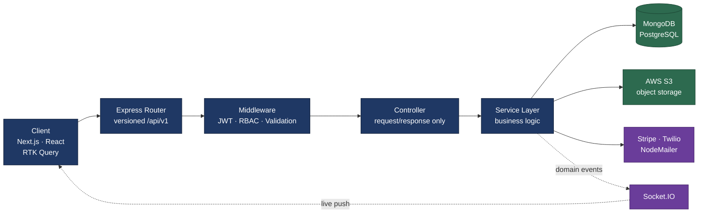
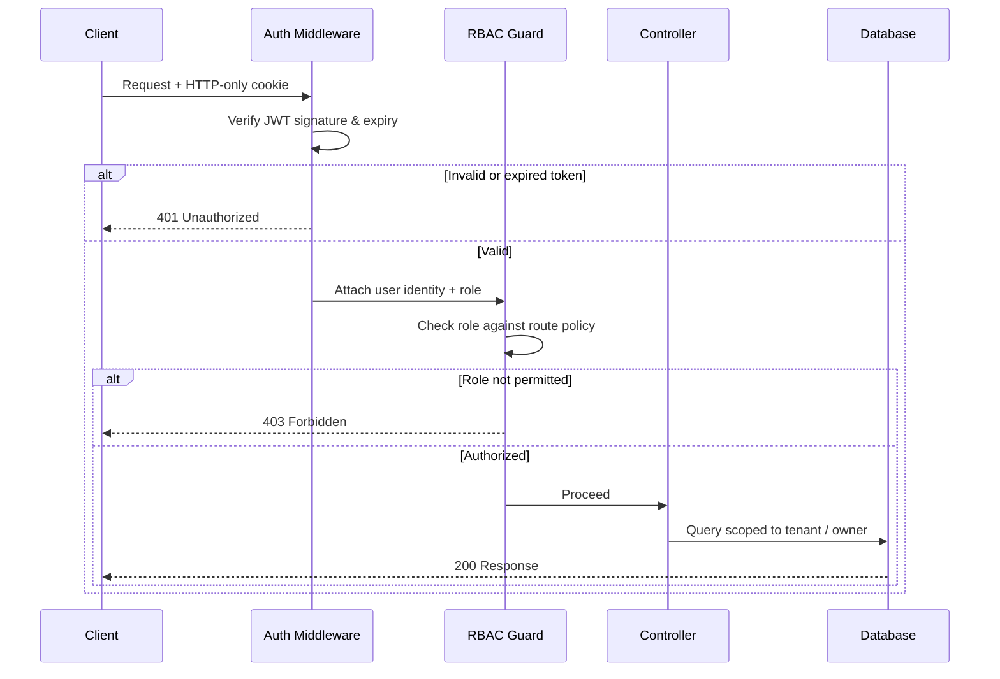
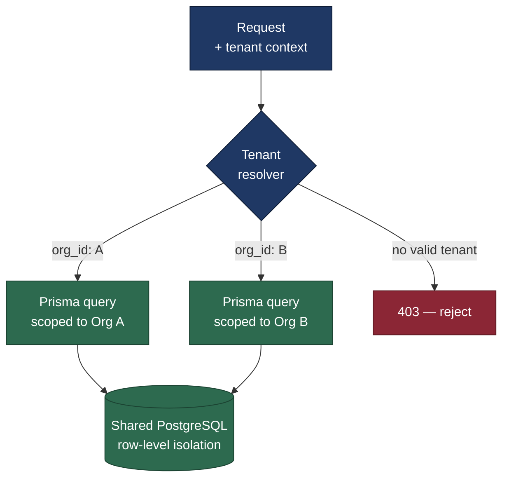
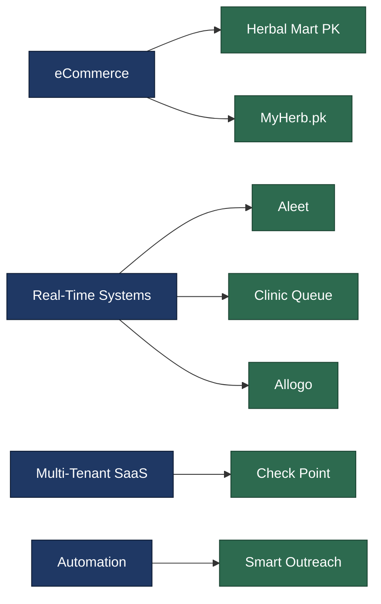
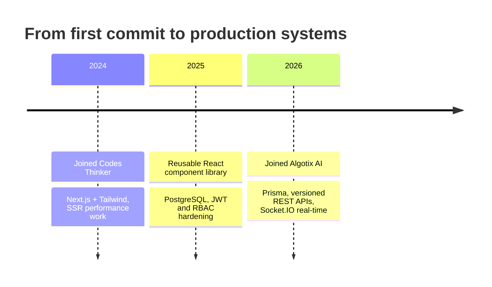

<h1 align="center">Allah Nawaz</h1>
<h3 align="center">Full Stack Developer · MERN & Next.js</h3>

  I build and ship production web applications — eCommerce platforms, real-time systems, and multi-tenant SaaS.

  
  
  

---

### About

- 🏢 Building at **Algotix AI** — versioned REST APIs, RBAC auth, and real-time notification workflows
- 🔭 Focused on **backend architecture, multi-tenant SaaS, and real-time systems**
- 🌱 Going deeper on **system design, TypeScript at scale, and DevOps fundamentals**
- 💬 Ask me about **REST API design, RBAC, Socket.IO, Next.js SSR, or Prisma schema modeling**
- 📬 Reach me at **nawaz51412@gmail.com**

---

## Tech Stack

**Frontend**

  

**Backend**

  

**Database & Storage**

  

**Deployment & Tooling**

  

**Also working with:** Socket.IO · RTK Query · Zustand · Mongoose · Stripe · Twilio · NodeMailer · PM2 · Puppeteer

---

## How I Build

**Request lifecycle** — middleware layering and controller–service separation, so business logic stays testable and transport concerns stay at the edge.

**Authentication & role-based access** — the path every protected request takes, including why a request gets a 401 versus a 403 and where tenant scoping is applied.

**Multi-tenant data isolation** — how tenant context is resolved and enforced before any query reaches shared storage.

---

## Projects

| Project | Domain | Stack | Live |
|---|---|---|---|
| **Herbal Mart PK** | Production eCommerce | Next.js · Node.js · MongoDB · RTK Query · Tailwind | [herbalmart.com.pk](https://herbalmart.com.pk/) |
| **Aleet** | Ride booking & payouts | Next.js · PostgreSQL · Stripe · AWS S3 · Twilio · Socket.IO | [aleet.app](https://www.aleet.app/) |
| **MyHerb.pk** | Full-stack eCommerce | Next.js · Node.js · MongoDB · Redux Toolkit · Tailwind | [my-herb-pk.vercel.app](https://my-herb-pk.vercel.app/) |
| **Clinic Queue** | Real-time workflow engine | React · Node.js · PostgreSQL · Socket.IO | [Demo](https://clinic-queue-frontend.vercel.app/) |
| **Allogo** | Logistics & ride booking | React · Node.js · MongoDB · Socket.IO · RBAC | [Demo](https://ailogo-gamma.vercel.app/) |
| **Check Point** | Multi-tenant SaaS | Node.js · PostgreSQL · Prisma ORM · RBAC | — |
| **Smart Outreach** | Internal automation | Node.js · MongoDB · REST APIs · Puppeteer | — |

---

## Engineering Journey

---

## GitHub Stats

  
  

---

  <a href="https://allahnawaz-dev.vercel.app/">Portfolio</a> ·
  <a href="https://www.linkedin.com/in/allahnawaz-dev/">LinkedIn</a> ·
  <a href="mailto:nawaz51412@gmail.com">nawaz51412@gmail.com</a>

